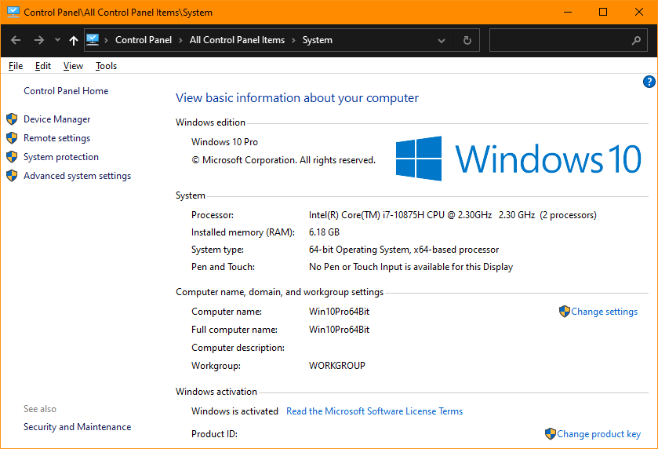
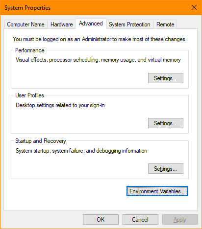
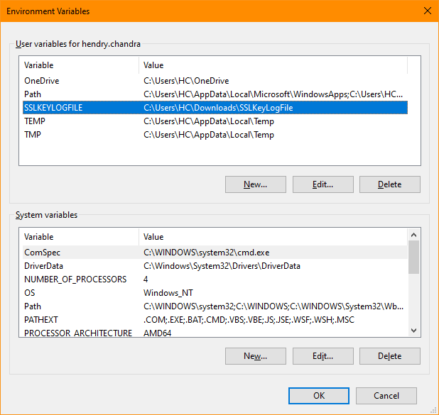
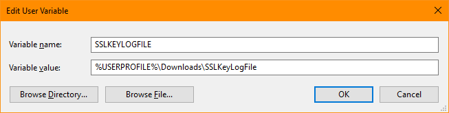
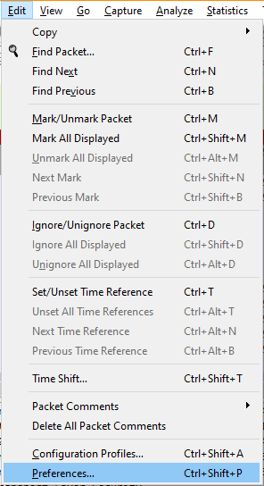
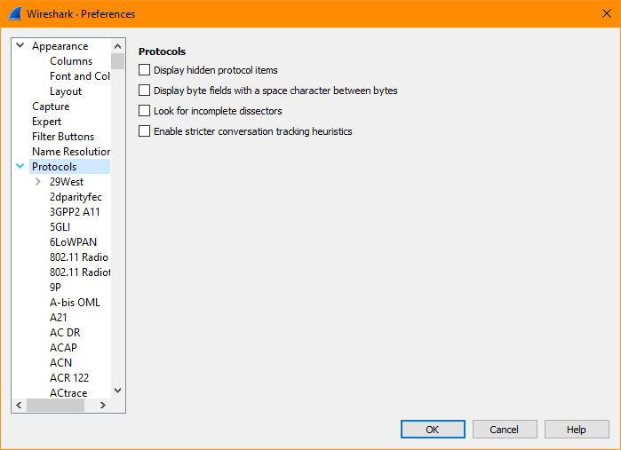
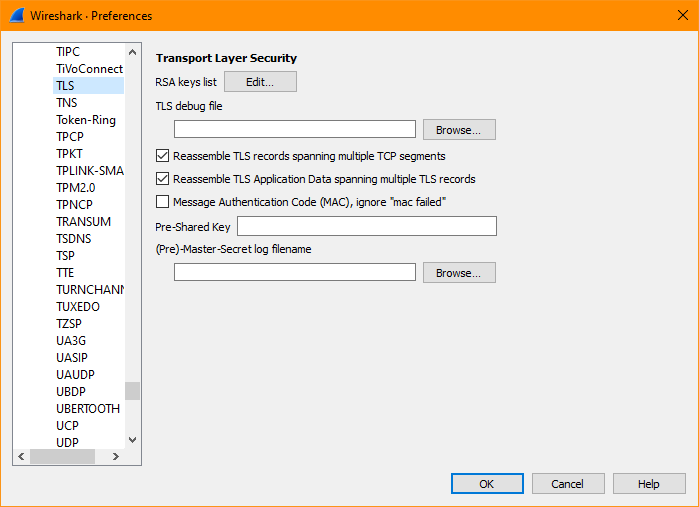
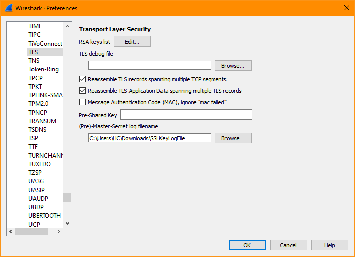

# DeCrypt TLS Traffic with Chrome and WireShark on Client Terminal

```
╔═════════════════════════════════════════════════════════════════════╗
║   References:                                                       ║
║   https://my.f5.com/manage/s/article/K50557518                      ║
╚═════════════════════════════════════════════════════════════════════╝
```

This procedure works on the Client side, where you wish to see only what happened with the traffic on the Client side.

This procedure presumably works on all types of protocols which Chrome Browser support and use TLS layer, including TLS on top of QUIC protocol (example for HTTP/3).

This procedure presumably also works in similar way in other OS platforms where you can install Chrome/Chromium and WireShark (tested on Windows 10 and Kali 2023.1-AMD64).


## Create Environment Variable

Create Environment Variable `SSLKEYLOGFILE` which Chrome/Chromium can access; such as `export SSLKEYLOGFILE=$HOME/SSLKeyLogFile` in Linux based OS, or other more permanent method(s).


On Windows based OS, below screen captures may help you to setup the `SSLKEYLOGFILE` Environment Variable.









The example screen capture points the `SSLKEYLOGFILE` Environment Variable to `SSLKeyLogFile` file located within the user's `Downloads` folder.

Once you're done setting up the `SSLKEYLOGFILE` Environment Variable, you may want to try running the Chrome/Chromium and access a TLS based site to see whether the `SSLKeyLogFile` file gets created and populated the content of the file.


For Linux based OS, if you do not create `SSLKEYLOGFILE` Environment Variable in a permanent way, you may want to launch Chrome/Chromium from the same CLI terminal as the one where you define the `SSLKEYLOGFILE` Environment Variable. Example:

`export SSLKEYLOGFILE=$HOME/SSLKeyLogFile;chromium`

or

`export SSLKEYLOGFILE=$HOME/SSLKeyLogFile;google-chrome`


## Configure Pre-Master Secret Log FileName at WireShark

Configure Pre-Master Secret Log FileName at WireShark to point at the same file indicated by the `SSLKEYLOGFILE` Environment Variable:

- [ ] In WireShark navigate to `Edit` > `Preferences...`<br>
   

- [ ] In the pop up window; click the `>` arrow in front of `Protocols` to expand a list of supported protocols<br>
   

- [ ] Scroll down the supported protocols list until you find `TLS`. Click on the `TLS` item. The menu on the right should change to display attributes of the `TLS` protocol<br>
   

- [ ] Under the `(Pre)-Master-Secret log filename` browse to the resulting Pre-Master Secret Log File ; i.e. the file indicated by the `SSLKEYLOGFILE` Environment Variable, which is created by Chrome/Chromium. Select the file, click Open, and then click OK<br>
   


## Capture and DeCrypt TLS Traffic

You should now be able to decrypt TLS payload/data on connections which you captured the Pre-Master Secret information.
Note that if you missed to capture the Pre-Master Secret information, TLS traffic which uses that Pre-Master Secret will not be decrypt-able.

One sequence that can be reviewed in order to avoid missing Pre-Master Secret information:

- [ ] Empty (delete the previous content) of the Pre-Master Secret Log File. Save the empty file, and Close the file.
- [ ] Open the Chrome/Chromium browser with empty tab/page.
- [ ] Open the WireShark and start to do capture on the target interface(s).
- [ ] Back to the empty browser, and start to browse to the target site.

With the above sequence, hopefully you will capture the entire session of the connections, including the TLS handshake which contains those Pre-Master Secret information.


<br><br><br>
```
╔═╦═════════════════╦═╗
╠═╬═════════════════╬═╣
║ ║ End of Document ║ ║
╠═╬═════════════════╬═╣
╚═╩═════════════════╩═╝
```
<br><br><br>


