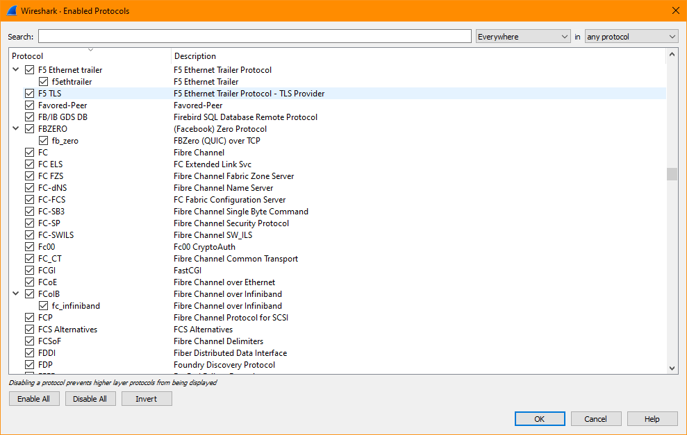
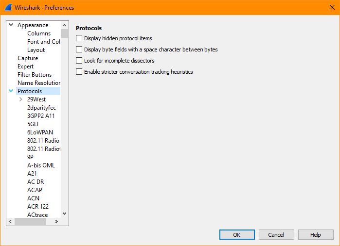
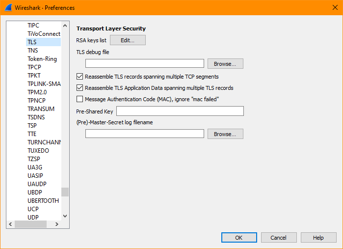
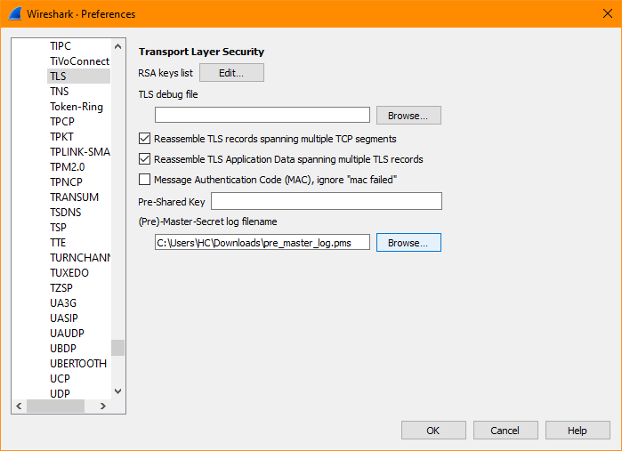
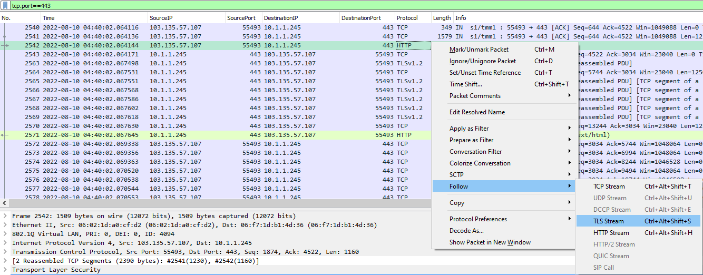
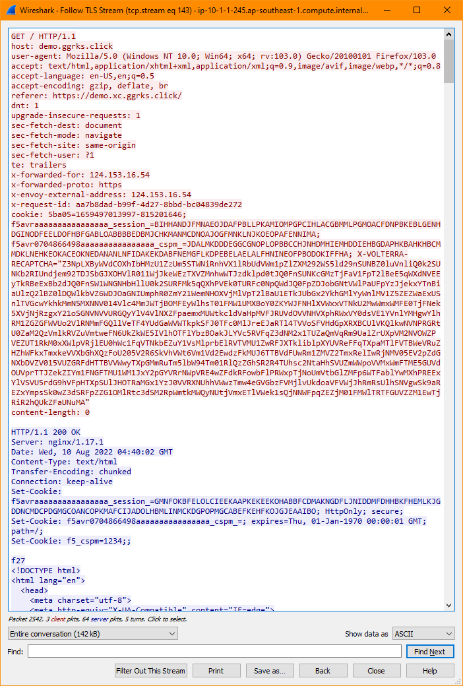

# Decrypt TLS TCPDump on Big-IP

```
╔══════════════════════════════════════════════════╗
║   Reference:                                     ║
║   https://my.f5.com/manage/s/article/K31793632   ║
║   https://my.f5.com/manage/s/article/K05822509   ║
╚══════════════════════════════════════════════════╝
```

PreRequisites:
- [ ] Big-IP version 15.0.0 or later
- [ ] `tshark` version 3.4.3 or later
- [ ] WireShark version 3.2 or later


## Enable TLS Session Secret Ethernet Trailers on Big-IP

SSH into the Big-IP and run the following command: `tmsh modify sys db tcpdump.sslprovider value enable` .

```
[admin@ip-10-1-1-245:Active:Standalone] ~ # tmsh list sys db tcpdump.sslprovider value
sys db tcpdump.sslprovider {
    value "disable"
}
[admin@ip-10-1-1-245:Active:Standalone] ~ # tmsh modify sys db tcpdump.sslprovider value enable
[admin@ip-10-1-1-245:Active:Standalone] ~ # tmsh list sys db tcpdump.sslprovider value
sys db tcpdump.sslprovider {
    value "enable"
}
[admin@ip-10-1-1-245:Active:Standalone] ~ #
```


## Capture Traffic with `--f5 ssl` flag on Big-IP

To utilize the (newly) enabled functionality above, use `--f5 ssl` flag/option when doing the TCPDump.
Example: ``tcpdump -vvv -s0 -nni 0.0:nnnp --f5 ssl -w /var/tmp/`/bin/hostname`_`date +%Y%m%d%H%M%S`.pcap`` .

Note that to be able to review the plain/decrypted TLS payload, you ***must ensure*** that the start of the TLS connections were recorded by the TCPDump.
This means: you execute the TCPDump command first, before you open the browser and browse to the URL of the service you want to troubleshoot.

```
[admin@ip-10-1-1-245:Active:Standalone] ~ # tcpdump -vvv -s0 -nni 0.0:nnnp --f5 ssl -w /var/tmp/`/bin/hostname`_`date +%Y%m%d%H%M%S`.pcap
tcpdump: WARNING: Using the "ssl" option captures additional information related to the SSL/TLS connections, such as master secrets. This enables some packet capture analysis tools to decrypt the SSL/TLS payload in the captured packets. Use only as needed for troubleshooting purposes, and handle captured data with caution.
tcpdump: listening on 0.0:nnnp, link-type EN10MB (Ethernet), capture size 65535 bytes
Got 9876543210
9876543210 packets received by filter
0 packets dropped by kernel
[admin@ip-10-1-1-245:Active:Standalone] ~ #
```

***Important***: When you perform a tcpdump capture with `tcpdump.sslprovider` enabled, please be ***reminded and warned*** that the TLS master secret will be written to the tcpdump capture itself. So you need to be mindful and careful with whom you share the capture file.

The same warning is also displayed when you do TCPDump: `tcpdump: WARNING: Using the "ssl" option captures additional information related to the SSL/TLS connections, such as master secrets. This enables some packet capture analysis tools to decrypt the SSL/TLS payload in the captured packets. Use only as needed for troubleshooting purposes, and handle captured data with caution.`


## Disable TLS Session Secret Ethernet Trailers on Big-IP

For security measures; ***Do NOT Forget*** to turn-off/disable the TLS Session Secret Ethernet Trailers feature, once you're finish with the Packet Capture activities: `tmsh modify sys db tcpdump.sslprovider value disable` .

```
[admin@ip-10-1-1-245:Active:Standalone] ~ # tmsh list sys db tcpdump.sslprovider value
sys db tcpdump.sslprovider {
    value "enable"
}
[admin@ip-10-1-1-245:Active:Standalone] ~ # tmsh modify sys db tcpdump.sslprovider value disable
[admin@ip-10-1-1-245:Active:Standalone] ~ # tmsh list sys db tcpdump.sslprovider value
sys db tcpdump.sslprovider {
    value "disable"
}
[admin@ip-10-1-1-245:Active:Standalone] ~ #
```


## Copy the Captured Traffic to Your Terminal

Copy the captured traffic to your terminal. This document assumes that you're using Windows and [WireShark](https://www.wireshark.org/) .
If you're using WinSCP to download the captured file from Big-IP, sometimes WinSCP may have some error in Drag and Drop files (to copy to/from remote Big-IP unit):<br>


You can try instead to Copy and Paste using the WinSCP menu; i.e. through right-click on the file you want to copy:<br>


And right-click on the directory you want the file to be copied into on your local host.<br>


## Create Pre-Master Secret Log File Using `tshark` on Your Terminal

PreRequisite: `tshark` version 3.4.3 or later. `tshark` is usually installed along together with WireShark by default. You can find `tshark.exe` in the installation directory of WireShark.
If you use default installation directory, you may be able to find it inside `C:\Program Files\Wireshark\`

The command syntax: `tshark -r` `[Captured Traffic File Path/Name]` `-Y f5ethtrailer.tls.keylog -Tfields -e f5ethtrailer.tls.keylog >` `[Resulting Pre-Master Secret File Path/Name]`

Example:
```
C:\Program Files\Wireshark>tshark -r C:\Users\HC\Downloads\ip-10-1-1-245.ap-southeast-1.compute.internal_20220810123945.pcap -Y f5ethtrailer.tls.keylog -Tfields -e f5ethtrailer.tls.keylog > C:\Users\HC\Downloads\pre_master_log.pms

C:\Program Files\Wireshark>
```

Note that you don't use space in the file paths and file names:
- [ ] `C:\Users\HC\Downloads\ip-10-1-1-245.ap-southeast-1.compute.internal_20220810123945.pcap`
- [ ] `C:\Users\HC\Downloads\pre_master_log.pms`

The resulting Pre-Master Secret file will be similar to the following:

```
C:\Users\HC\Downloads>type pre_master_log.pms
CLIENT_RANDOM e442c47ca13717c4f7217175cf74c474b64e9262cc1ed8f29fb136885ce03dd0 21d0829467bdb91f32bf5c8aa97d6a7f1bf73f208bfdfe80005cd393d9f517f5c2a0a0e14cc93d4588f6dfd4bfd54c05
CLIENT_RANDOM f6c16dc760af06c21e8b020869b537dd5253d23a5b8f1594aaee5841f9450f1b 21d0829467bdb91f32bf5c8aa97d6a7f1bf73f208bfdfe80005cd393d9f517f5c2a0a0e14cc93d4588f6dfd4bfd54c05
CLIENT_RANDOM 4aa1a56d4bd45f738e77c28aeab093daf25cbbbd6bb8e984c2be7d223610ff33 21d0829467bdb91f32bf5c8aa97d6a7f1bf73f208bfdfe80005cd393d9f517f5c2a0a0e14cc93d4588f6dfd4bfd54c05
CLIENT_RANDOM 0b22c0132ecf9efaf658a330b3c5291403c2e4a080d9238ce8d5d24925791083 314d4cb6515c042ca97f7668931d0644ad8a0899dc07c66e43f6993704a226b104b4f349baf4ec8c3e9e47c6a82877d7
CLIENT_RANDOM bd7e553ad72f5649012af52770279d586b079c9a48b9f982f24aa1a43291b731 314d4cb6515c042ca97f7668931d0644ad8a0899dc07c66e43f6993704a226b104b4f349baf4ec8c3e9e47c6a82877d7
CLIENT_RANDOM 928810474f9d6ff8f1fdc5c382050f69ba981e434e782214b71f3160a4786a19 314d4cb6515c042ca97f7668931d0644ad8a0899dc07c66e43f6993704a226b104b4f349baf4ec8c3e9e47c6a82877d7
CLIENT_RANDOM 76eaab5a55092ac94e7a2ccf5813e1f1424222545311eaa79af1b6fde3820be6 7789b547f931ed20bf694f7a6342fdcc711ebf378d5793441a0ab284ad0f876983db11bd98a10f686716945daac21a26
CLIENT_RANDOM b4609d23105ac019b9ca3d9ea044a01f54b4a4eec24f30db0b9d460b70da986c 7789b547f931ed20bf694f7a6342fdcc711ebf378d5793441a0ab284ad0f876983db11bd98a10f686716945daac21a26
CLIENT_RANDOM 221b7e5438d07996adee457ec199b07d8987f1e1286b58df92d78e71123a9777 7789b547f931ed20bf694f7a6342fdcc711ebf378d5793441a0ab284ad0f876983db11bd98a10f686716945daac21a26

C:\Users\HC\Downloads>
```


## Enable F5 Ethernet Trailers for TLS at WireShark on Your Terminal

Open WireShark (version 3.2 or later) and ensure you have the F5 TLS Dissector enabled.

- [ ] Navigate to `Analyze` > `Enabled Protocols...`<br>
   

- [ ] In the pop up window; scroll down to `F5 TLS` `F5 Ethernet Trailer Protocol - TLS Provider`, and check the box in front of `F5 TLS` to enable it.<br>
   


## Load Pre-Master Secret Log File into WireShark on Your Terminal

Load the Pre-Master Secret Log file into WireShark to decrypt TLS payload:

- [ ] In WireShark navigate to `Edit` > `Preferences...`<br>
   

- [ ] In the pop up window; click the `>` arrow in front of `Protocols` to expand a list of supported protocols<br>
   

- [ ] Scroll down the supported protocols list until you find `TLS`. Click on the `TLS` item. The menu on the right should change to display attributes of the `TLS` protocol<br>
   

- [ ] Under the `(Pre)-Master-Secret log filename` browse to the resulting Pre-Master Secret file (i.e. from the example above, it is `C:\Users\HC\Downloads\pre_master_log.pms` file) and click Open, and then click OK<br>
   

You should now be able to decrypt TLS payload/data on connections which you captured the Pre-Master Secret information.


## Review Decrypted HTTPS (HTTP over TLS) Messages on Your Terminal

To review decrypted messages faster, try to filter the displayed packets with `tcp.port==443`, then look for HTTP protocol (usually coloured differently).



Right-click on the HTTP line item, and from the pop-up menu select `Follow` > `TLS Stream`.



You can now review the plain/decrypted HTTP communications between the Client and the Server.


<br><br><br>
```
╔═╦═════════════════╦═╗
╠═╬═════════════════╬═╣
║ ║ End of Document ║ ║
╠═╬═════════════════╬═╣
╚═╩═════════════════╩═╝
```
<br><br><br>


