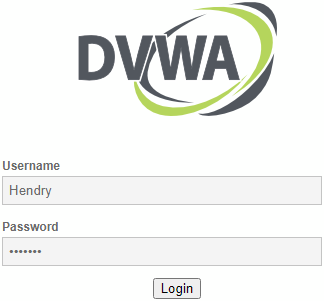
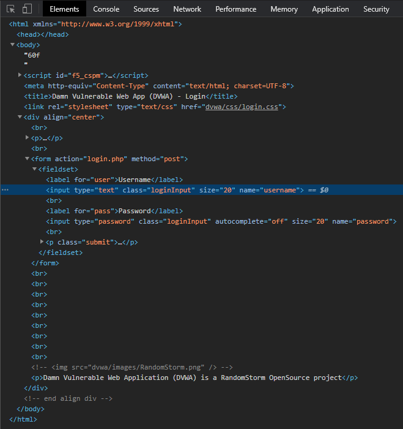
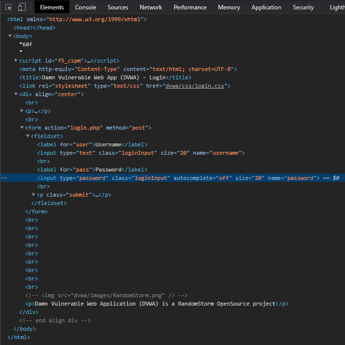
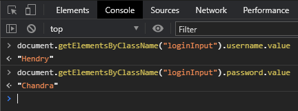
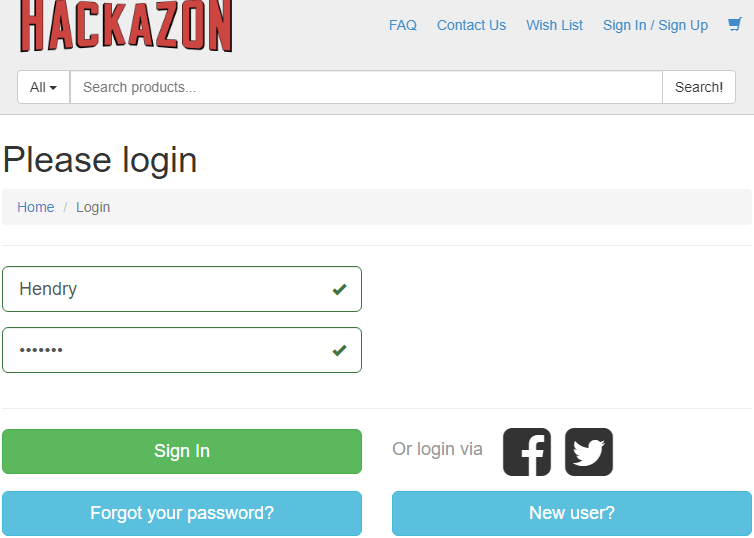
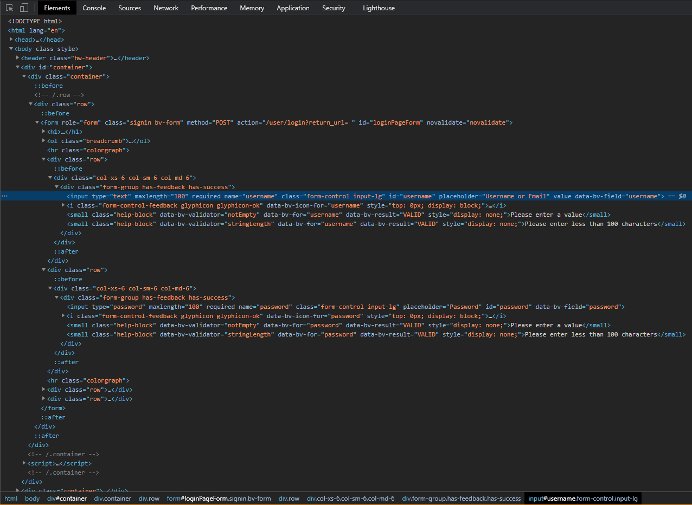
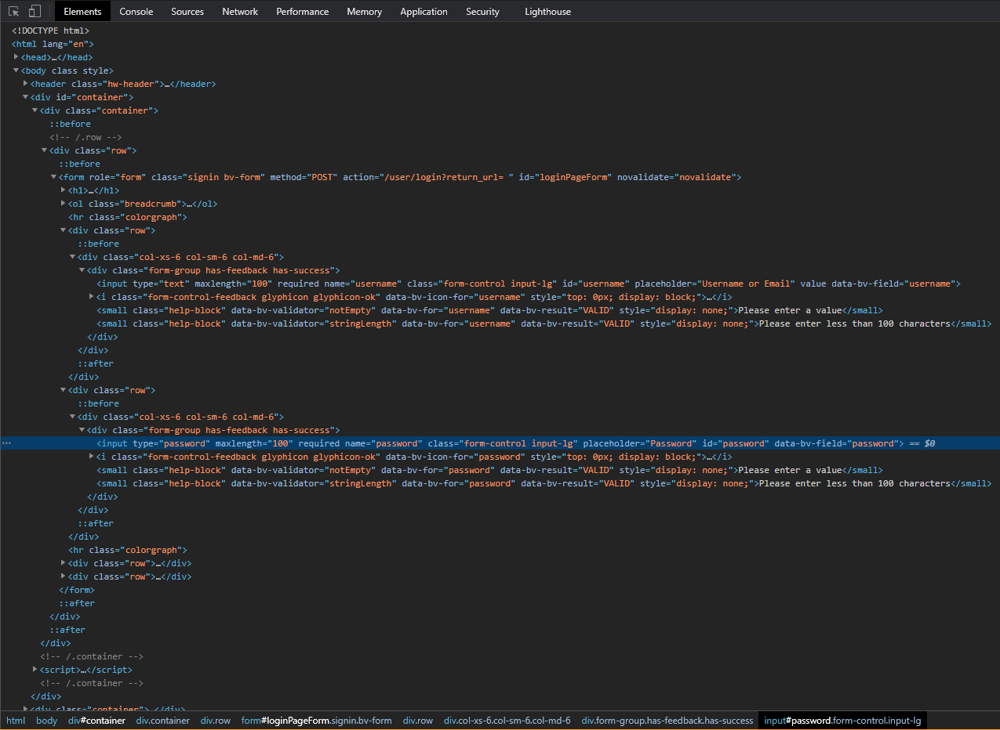
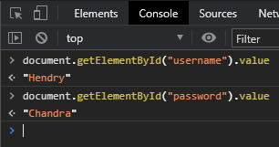

# Inspect UserName and Password Input Field on Chrome

## DVWA



On the rendered login screen, enter a User Name and Password information for the demo. Then right-click on the "usename" field, and choose menu "inspect". The "Elements" window will focus on the "username" field. Study the structure of the "username" element.



Similarly, on the rendered login screen, right-click on the "password" field, and choose menu "inspect". The "Elements" window will focus on the "password" field. Study the structure of the "password" element.



On "Console" tab, enter the commands :

```
document.getElementsByClassName("loginInput").username.value
document.getElementsByClassName("loginInput").password.value
```



After each command, the previously entered User Name and Password information will be printed out on the console.


## Hackazon



On the rendered login screen, enter a User Name and Password information for the demo. Then right-click on the "usename" field, and choose menu "inspect". The "Elements" window will focus on the "username" field. Study the structure of the "username" element.



Similarly, on the rendered login screen, right-click on the "password" field, and choose menu "inspect". The "Elements" window will focus on the "password" field. Study the structure of the "password" element.



On "Console" tab, enter the commands :

```
document.getElementById("username").value
document.getElementById("password").value
```



After each command, the previously entered User Name and Password information will be printed out on the console.


<br><br><br>
`╔═╦═════════════════╦═╗`<br>
`║ ║                 ║ ║`<br>
`╠═╬═════════════════╬═╣`<br>
`║ ║ End of Document ║ ║`<br>
`╠═╬═════════════════╬═╣`<br>
`║ ║                 ║ ║`<br>
`╚═╩═════════════════╩═╝`<br>
<br><br><br>


