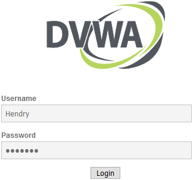
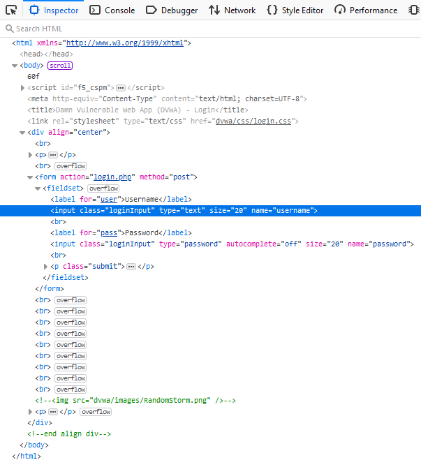
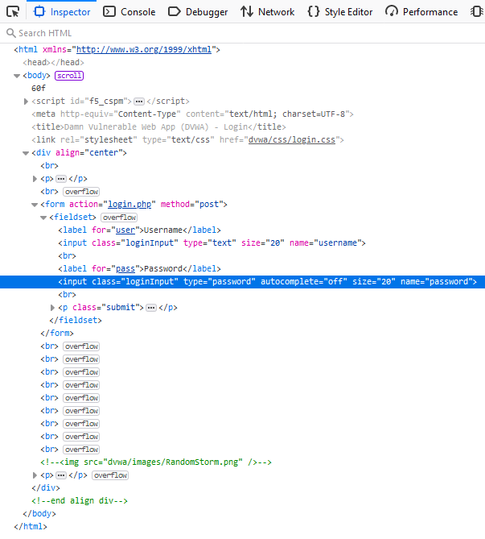
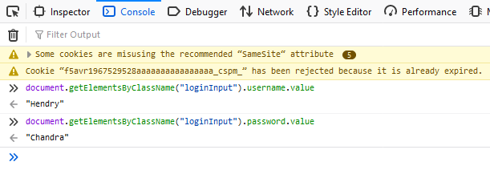
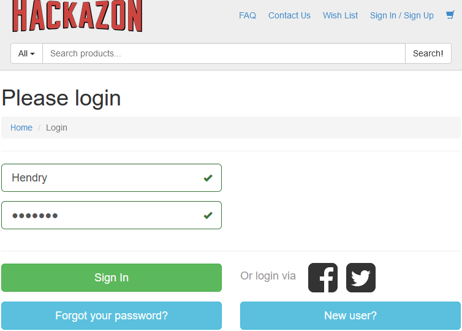
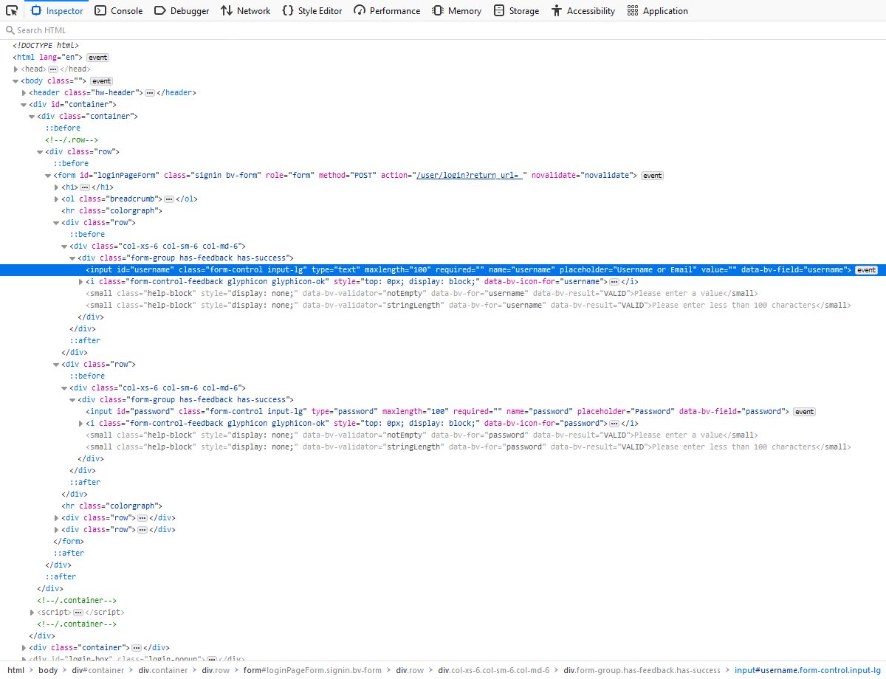
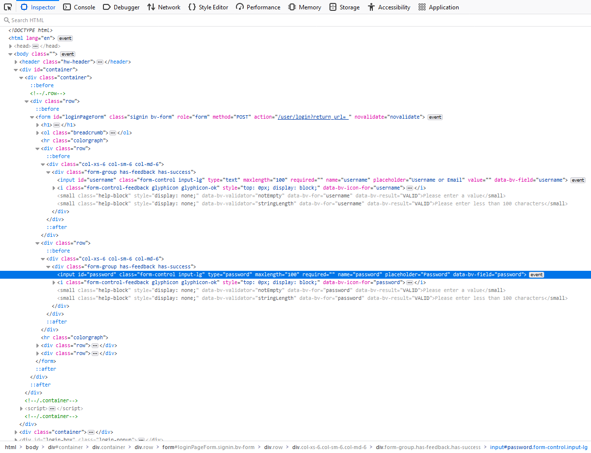
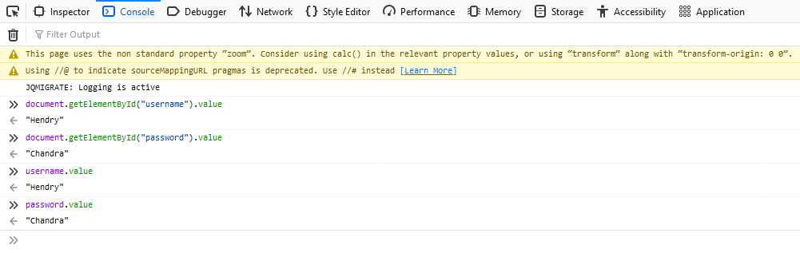

# Inspect UserName and Password Input Field on FireFox

Obtaining the "username" and "password" information from Input Field of a browser depends on:
- [ ] The Browser itself. Some browsers provide shortcut commands, others don't. But they all share a formal syntax to obtain the "username" and "password" information from the Input Field.
- [ ] The Source Code of the page itself. Each pages structured uniquely, differently depending on the developer. Study towards the page structure must be done BEFORE the demo.


## DVWA



On the rendered login screen, enter a User Name and Password information for the demo. Then right-click on the "usename" field, and choose menu "Inspect Element". The "Inspector" window will focus on the "username" field. Study the structure of the "username" element.



Similarly, on the rendered login screen, right-click on the "password" field, and choose menu "Inspect Element". The "Inspector" window will focus on the "password" field. Study the structure of the "password" element.



On "Console" tab, enter the commands :

```
document.getElementsByClassName("loginInput").username.value
document.getElementsByClassName("loginInput").password.value
```



After each command, the previously entered User Name and Password information will be printed out on the console.


## Hackazon



On the rendered login screen, enter a User Name and Password information for the demo. Then right-click on the "usename" field, and choose menu "Inspect Element". The "Inspector" window will focus on the "username" field. Study the structure of the "username" element.



Similarly, on the rendered login screen, right-click on the "password" field, and choose menu "Inspect Element". The "Inspector" window will focus on the "password" field. Study the structure of the "password" element.



On "Console" tab, enter the commands :

```
document.getElementById("username").value
document.getElementById("password").value
```

Alternatively, in this case (FireFox with Hackazon site), there is a shortcut command as below:

```
username.value
password.value
```



After each command, the previously entered User Name and Password information will be printed out on the console.


<br><br><br>
```
╔═╦═════════════════╦═╗
╠═╬═════════════════╬═╣
║ ║ End of Document ║ ║
╠═╬═════════════════╬═╣
╚═╩═════════════════╩═╝
```
<br><br><br>


